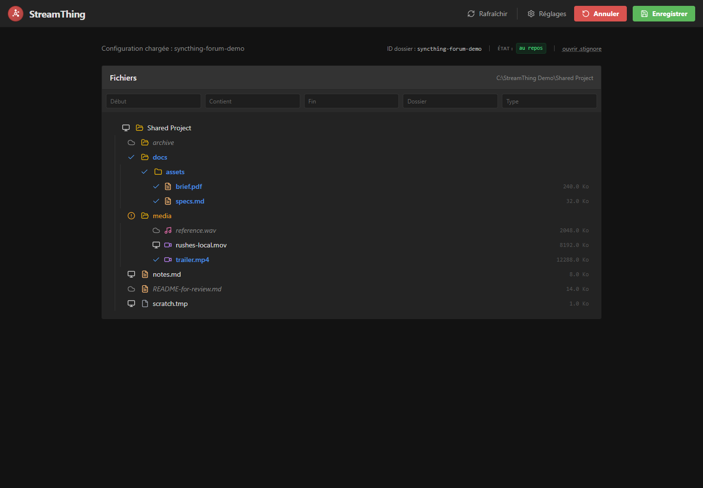
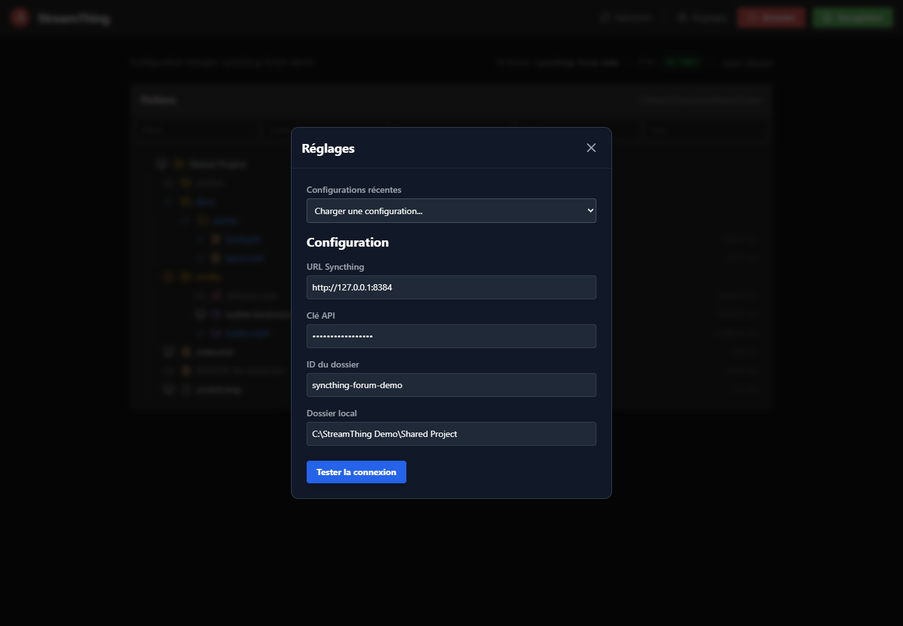
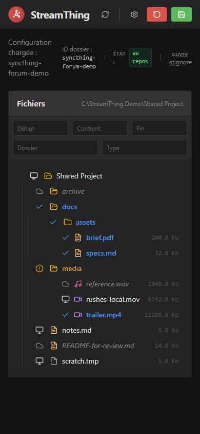

# Draft Syncthing Forum Post

## Suggested Title

StreamThing: a small Windows companion for selective sync with `.stignore`

## Post

Hi,

I am sharing StreamThing, a small Windows desktop companion for Syncthing selective sync.

It does not replace Syncthing and it does not synchronize files by itself. Syncthing remains the engine. StreamThing reads the local Syncthing configuration, opens one folder, shows what is present locally and what Syncthing reports, then writes the matching `.stignore` rules for the files or folders you want to keep synchronized.

Current scope:

- Windows desktop app built with Tauri and Solid.
- Installer plus `streamthing` CLI.
- CLI commands to list folders, inspect status, configure or launch one folder, and request a scan.
- Folder selection writes recursive include rules such as `!/docs` and `!/docs/**`.
- Syncthing scans are requested only on explicit actions: refresh, save, launch with `--scan`, or direct `scan`.

Screenshots:







Install:

1. Download the latest Windows installer from the GitHub Releases page.
2. Run `StreamThing_*_x64-setup.exe`.
3. Open a new terminal.
4. Check the CLI with:

```powershell
streamthing --version
```

Typical usage:

```powershell
streamthing list-folders --only-active
streamthing launch --folder-id "my-folder-id" --stop-existing
streamthing status --folder-id "my-folder-id"
```

The current installer is unsigned, so Windows may show a publisher warning.

Repository and releases:

- GitHub: https://github.com/NathanOtano/StreamThing
- Releases: https://github.com/NathanOtano/StreamThing/releases

Feedback welcome, especially from people who rely heavily on `.stignore` and selective sync workflows.
